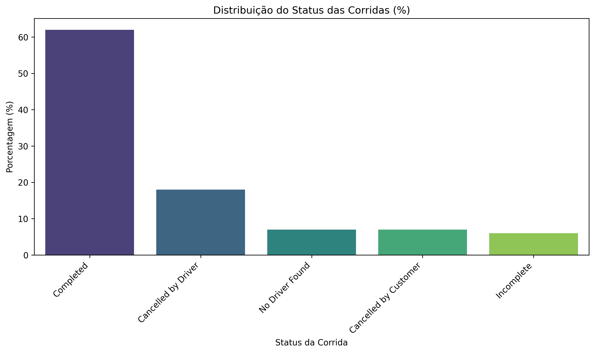
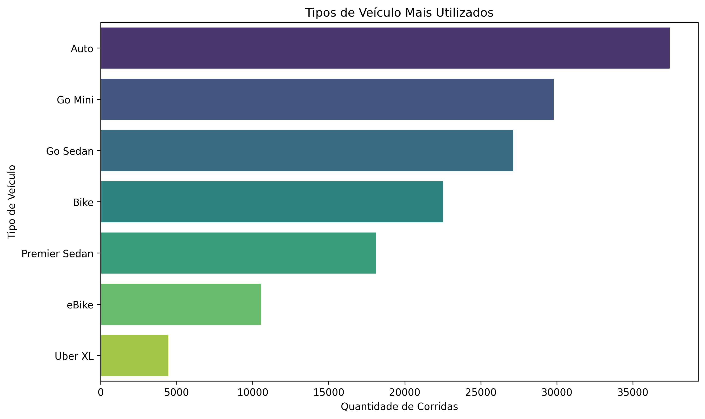
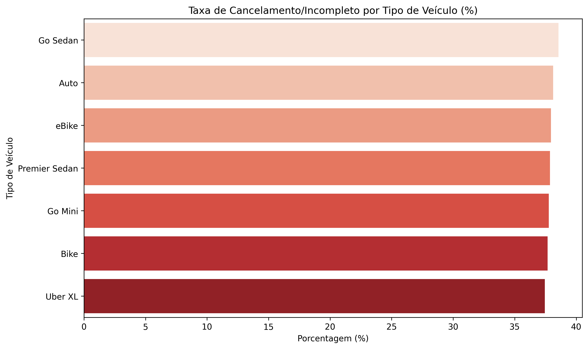
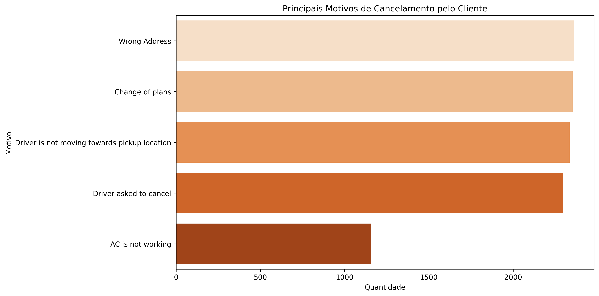
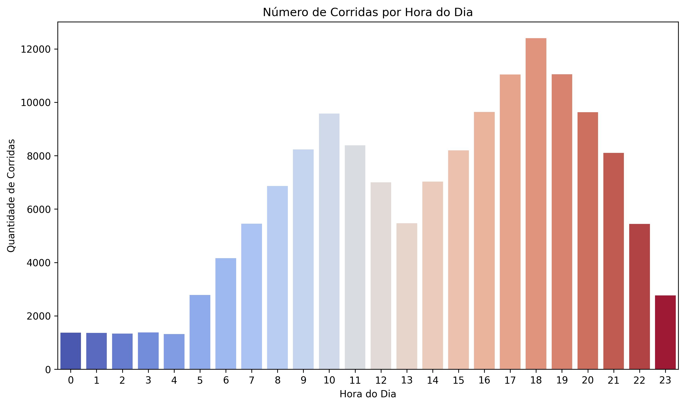
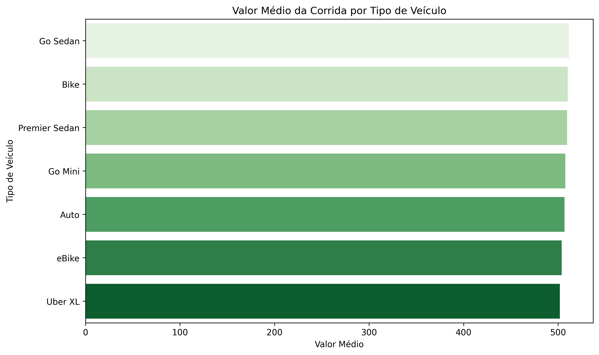

# Análise Exploratória de Dados - Uber Ride Analytics (2024)

**Atividade Prática Extra – Introdução à Inteligência Artificial (SENAI/SC LAB365)**  
**Aluna:** Emily de Souza Escobar Afonso 
**Data:** 23 de Fevereiro de 2026  
**Objetivo:** Realizar uma AED simples no dataset "uber-ride-analytics-dashboard" (Kaggle) para compreender padrões de utilização do serviço Uber, variações temporais, características das corridas e indicar aplicações introdutórias em IA (classificação e regressão), conforme descritivo do desafio.

## Sobre o Dataset
- Fonte: [Kaggle – Uber Ride Analytics Dashboard](https://www.kaggle.com/datasets/yashdevladdha/uber-ride-analytics-dashboard/data)  
- Arquivo principal: `ncr_ride_bookings.csv` (~148 mil linhas, 21 colunas)  
- Período: Dados de 2024  
- Colunas principais usadas: Booking Status, Vehicle Type, Hour, Booking Value, Reason for cancelling by Customer, etc.

## Etapas Realizadas
1. **Coleta** – Download do Kaggle  
2. **Preparação** – Conversão de datas/horas, criação de features (Hour, Day_of_Week, Month)  
3. **Limpeza** – Verificação de valores ausentes (nenhum ou mínimo)  
4. **Exploração** – 6 visualizações geradas com pandas + seaborn/matplotlib

## Visualizações Geradas
  
  
  
  
  

## Principais Insights
- ~66% das corridas completadas, ~19% canceladas por cliente (alta taxa de churn).  
- Veículos econômicos (Auto, eBike/Bike) dominam o uso.  
- Picos de corridas em horários comerciais e noturnos (mobilidade urbana).  
- Valor médio mais alto em veículos premium (UberXL ~500, Premier Sedan ~400+).  
- Motivos comuns de cancelamento: problemas operacionais (endereço errado, motorista parado).

## Aplicações em Inteligência Artificial
Os padrões identificados apoiam modelos introdutórios de IA:  
- **Classificação**: prever se uma corrida será cancelada (target: Booking Status ≠ Completed).  
- **Regressão**: estimar valor da corrida ou tempo de viagem com base em tipo de veículo, hora e distância.
